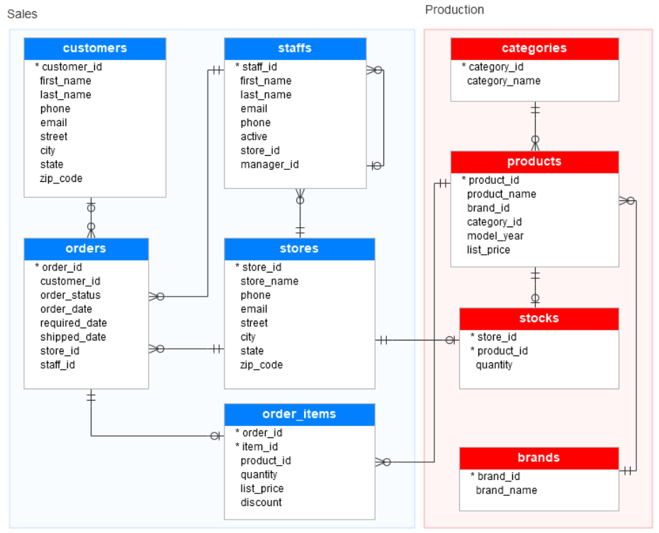

# Loading Sample Database

Here is the sample `BikeStores` database that we will load into our SQL Server instance. 

**Restoration steps are available in [`queries/bikestores-sample-db`](../queries/BikeStoresSampleDB/)**

- 2 schemas
- 9 tables



## DB Tables

### `sales.stores`

Contains the store information

- **A store employs staff (1-to-many)**
  - A store can employ many staff
  - A staff can only works for one store
- **A store takes orders (1-to-many)**
  - A store can take many orders
  - An order can only be taken by one store
- **A store have stock inventory (1-to-1)**
  - A store can have one or no stock inventory
  - A stock inventory can only be assigned to one store

```sql
CREATE TABLE sales.stores (
  store_id INT IDENTITY (1, 1) PRIMARY KEY,
  store_name VARCHAR (255) NOT NULL,
  phone VARCHAR (25),
  email VARCHAR (255),
  street VARCHAR (255),
  city VARCHAR (255),
  state VARCHAR (10).
  zip_code VARCHAR (5)
);
```

### `sales.customers`

Contains customer's information

- **A customer makes an order (1-to-many)**
  - A customer can create many order
  - An order can only be assigned to one customer

```sql
CREATE TABLE sales.customers (
  customer_id INT IDENTITY (1, 1) PRIMARY KEY,
  first_name VARCHAR (255) NOT NULL,
  last_name VARCHAR (255) NOT NULL,
  phone VARCHAR (25),
  email VARCHAR (255) NOT NULL,
  street VARCHAR (255),
  city VARCHAR (50),
  state VARCHAR (25),
  zip_code VARCHAR (5)
);
```

### `sales.staffs`

Contains staff information

- **A staff works at a store (1-to-many)**
  - A staff can only works for one store
  - A store can employ many staff
- **A staff reports to a store manager (1-to-many)**
  - A staff can only report to one manager
  - A manager can oversee many staff
  - If the value in the `manager_id` is null, then the staff is the top manager
  - If a staff no longer works for any stores, the value in the active column is set to zero
- **A staff creates an order (1-to-many)**
  - A staff can create many orders
  - An order can only be created by one staff

```sql
CREATE TABLE sales.staffs (
  staff_id INT IDENTITY (1, 1) PRIMARY KEY,
  first_name VARCHAR (50) NOT NULL,
  last_name VARCHAR (50) NOT NULL,
  email VARCHAR (255) NOT NULL UNIQUE,
  phone VARCHAR (25),
  active tinyint NOT NULL,
  store_id INT NOT NULL,
  manager_id INT,
  FOREIGN KEY (store_id)
    REFERENCES sales.stores (store_id)
    ON DELETE CASCADE ON UPDATE CASCADE,
  FOREIGN KEY (manager_id)
    REFERENCES sales.staffs (staff_id)
    ON DELETE NO ACTION ON UPDATE NO ACTION
);
```

### `sales.orders`

Contains sales order's header information

- **An order is created by a staff (1-to-many)**
  - An order can only be created by one staff
  - A staff can create many orders
- **An order is created by a customer (1-to-many)**
  - An order can only be assigned to one customer
  - A customer can create many order
- **An order is handled by a store (1-to-many)**
  - An order can only be taken by one store
  - A store can take many orders
- **An order has order items (1-to-1)**
  - An order may contains an order items
  - An order item can only be assigned one order

```sql
CREATE TABLE sales.orders (
  order_id INT IDENTITY (1, 1) PRIMARY KEY,
  customer_id INT,
  order_status tinyint NOT NULL,
  -- Order status: 1 = Pending; 2 = Processing; 3 = Rejected; 4 = Completed
  order_date DATE NOT NULL,
  required_date DATE NOT NULL,
  shipped_date DATE,
  store_id INT NOT NULL,
  staff_id INT NOT NULL,
  FOREIGN KEY (customer_id)
    REFERENCES sales.customers (customer_id)
    ON DELETE CASCADE ON UPDATE CASCADE,
  FOREIGN KEY (store_id)
    REFERENCES sales.stores (store_id)
    ON DELETE CASCADE ON UPDATE CASCADE,
  FOREIGN KEY (staff_id)
    REFERENCES sales.staffs (staff_id)
    ON DELETE NO ACTION ON UPDATE NO ACTION
);
```

### `sales.order_items`

Contains the line items of a sales order

- **An order item is assigned to an order (1-to-1)**
  - An order item can only be assigned one order
  - An order may contains an order items
- **An order item can contain products (1-to-many)**
  - An order item can only contain one product
  - A product could be assigned to many order items

```sql
CREATE TABLE sales.order_items(
  order_id INT,
  item_id INT,
  product_id INT NOT NULL,
  quantity INT NOT NULL,
  list_price DECIMAL (10, 2) NOT NULL,
  discount DECIMAL (4, 2) NOT NULL DEFAULT 0,
  PRIMARY KEY (order_id, item_id),
  FOREIGN KEY (order_id)
    REFERENCES sales.orders (order_id)
    ON DELETE CASCADE ON UPDATE CASCADE,
  FOREIGN KEY (product_id)
    REFERENCES production.products (product_id)
    ON DELETE CASCADE ON UPDATE CASCADE
);
```

### `production.categories`

Contains the bike's categories

```sql
CREATE TABLE production.categories (
  category_id INT IDENTITY (1, 1) PRIMARY KEY,
  scategory_name VARCHAR (255) NOT NULL
);
```

### `production.products`

Contains the product's information

```sql
CREATE TABLE production.products (
  product_id INT IDENTITY (1, 1) PRIMARY KEY,
  product_name VARCHAR (255) NOT NULL,
  brand_id INT NOT NULL,
  category_id INT NOT NULL,
  model_year SMALLINT NOT NULL,
  list_price DECIMAL (10, 2) NOT NULL,
  FOREIGN KEY (category_id)
    REFERENCES production.categories (category_id)
    ON DELETE CASCADE ON UPDATE CASCADE,
  FOREIGN KEY (brand_id)
    REFERENCES sales.brands (brand_id)
    ON DELETE CASCADE ON UPDATE CASCADE
);
```

### `production.stocks`

Contains the inventory information

```sql
CREATE TABLE production.stocks (
  store_id INT,
  product_id INT,
  quantity INT,
  PRIMARY KEY (store_id, product_id),
  FOREIGN KEY (store_id)
    REFERENCES sales.stores (store_id)
    ON DELETE CASCADE ON UPDATE CASCADE,
  FOREIGN KEY (product_id)
    REFERENCES production.products (product_id)
    ON DELETE CASCADE ON UPDATE CASCADE
);
```

### `production.brands`

Contains the brand’s information of bikes

```sql
CREATE TABLE production.brands (
  brand_id INT IDENTITY (1, 1) PRIMARY KEY,
  brand_name VARCHAR (255) NOT NULL
);
```
