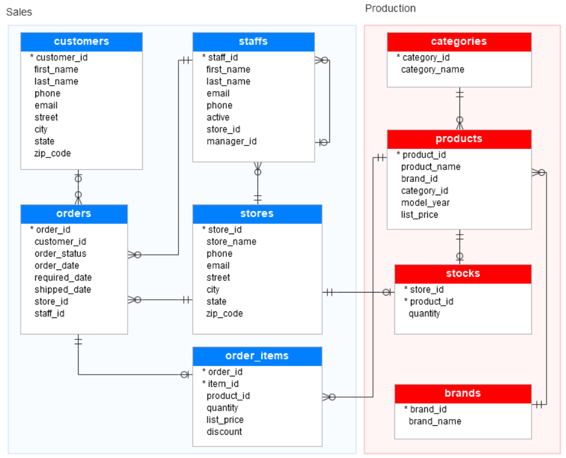

# Loading Sample Database

---

- [DB Tables](#db-tables)
  - [`Sales.Stores`](#salesstores)
  - [`Sales.Customers`](#salescustomers)
  - [`Sales.Staffs`](#salesstaffs)
  - [`Sales.Orders`](#salesorders)
  - [`Sales.Order_Items`](#salesorder_items)
  - [`Production.Categories`](#productioncategories)
  - [`Production.Products`](#productionproducts)
  - [`Production.Stocks`](#productionstocks)
  - [`Production.Brands`](#productionbrands)

---

- Here is the sample `BikeStores` database that we will load into our SQL Server instance
  - **Restoration steps are available in [`queries/BikeStoresSampleDB`](../queries/BikeStoresSampleDB/)**
  - 2 schemas
  - 9 tables



## DB Tables

### `Sales.Stores`

- Contains the Store information
- Relationships:
  - **A Store employs Staff (1-to-many)**
    - A Store can employ 0 to many Staff
    - A Staff can be employed by only 1 Store
  - **A Store handles Orders (1-to-many)**
    - A Store can handle 0 to many Orders
    - An Order can be handled by only 1 Store
  - **A Store has Stock inventory (1-to-1)**
    - A Store can have 0 or 1 Stock inventory
    - A Stock inventory can be had by only 1 Store

```sql
CREATE TABLE Sales.Stores (
      Store_Id INT IDENTITY (1, 1) PRIMARY KEY,
    Store_Name VARCHAR(255) NOT NULL,
         Phone VARCHAR(25),
         Email VARCHAR(255),
        Street VARCHAR(255),
          City VARCHAR(255),
       "State" VARCHAR(10),
      Zip_Code VARCHAR(5)
);
```

### `Sales.Customers`

- Contains Customer's information
- Relationships:
  - **A Customer makes an Order (1-to-many)**
    - A Customer can make 0 to many Order
    - An Order can be made by 0 or 1 Customer

```sql
CREATE TABLE Sales.Customers (
    Customer_Id INT IDENTITY (1, 1) PRIMARY KEY,
     First_Name VARCHAR(255) NOT NULL,
      Last_Name VARCHAR(255) NOT NULL,
          Phone VARCHAR(25),
          Email VARCHAR(255) NOT NULL,
         Street VARCHAR(255),
           City VARCHAR(50),
        "State" VARCHAR(25),
       Zip_Code VARCHAR(5)
);
```

### `Sales.Staffs`

- Contains Staff information
- Relationships:
  - **A Staff is employed by a Store (1-to-many)**
    - A Staff can be employed by only 1 Store
    - A Store can employ 0 to many Staff
  - **A Staff reports to a Manager (1-to-many)**
    - A Staff can report to 0 or 1 Manager
    - A Manager can be reported to by 0 to many Staff
    - If the value in the `Manager_Id` is `null`, then the Staff is the top manager
    - If a Staff no longer works for any Stores, the value in the active column is set to `0`
  - **A Staff creates an Order (1-to-many)**
    - A Staff can create 0 to many Orders
    - An Order can be created by only 1 Staff

```sql
CREATE TABLE Sales.Staffs (
      Staff_Id INT IDENTITY (1, 1) PRIMARY KEY,
    First_Name VARCHAR(50) NOT NULL,
     Last_Name VARCHAR(50) NOT NULL,
         Email VARCHAR(255) NOT NULL UNIQUE,
         Phone VARCHAR(25),
        Active TINYINT NOT NULL,
      Store_Id INT NOT NULL,
    Manager_Id INT,
       FOREIGN KEY (Store_Id) REFERENCES Sales.Stores (Store_Id)
               ON DELETE CASCADE
               ON UPDATE CASCADE,
       FOREIGN KEY (Manager_Id) REFERENCES Sales.Staffs (Staff_Id)
               ON DELETE NO ACTION
               ON UPDATE NO ACTION
);
```

### `Sales.Orders`

- Contains Sales Order's header information
- Relationships:
- **An Order is created by a Staff (1-to-many)**
  - An Order can be created by only 1 Staff
  - A Staff can create 0 to many Orders
- **An Order is made by a Customer (1-to-many)**
  - An Order can be made by 0 or 1 Customer
  - A Customer can make 0 to many Order
- **An Order is handled by a Store (1-to-many)**
  - An Order can be handled by only 1 Store
  - A Store can handle 0 to many Orders
- **An Order is made of Order Items (1-to-1)**
  - An Order can be made of 0 or 1 Order Item
  - An Order Item can make up only 1 Order

```sql
CREATE TABLE Sales.Orders (
         Order_Id INT IDENTITY (1, 1) PRIMARY KEY,
      Customer_Id INT,
     Order_Status TINYINT NOT NULL,
    -- Order status:
    --  1 = Pending;
    --  2 = Processing;
    --  3 = Rejected;
    --  4 = Completed
       Order_Date DATE NOT NULL,
    Required_Date DATE NOT NULL,
     Shipped_Date DATE,
         Store_Id INT NOT NULL,
         Staff_Id INT NOT NULL,
          FOREIGN KEY (Customer_Id) REFERENCES Sales.Customers (Customer_Id)
                  ON DELETE CASCADE
                  ON UPDATE CASCADE,
          FOREIGN KEY (Store_Id) REFERENCES Sales.Stores (Store_Id)
                  ON DELETE CASCADE
                  ON UPDATE CASCADE,
          FOREIGN KEY (Staff_Id) REFERENCES Sales.Staffs (Staff_Id)
                  ON DELETE NO ACTION
                  ON UPDATE NO ACTION
);
```

### `Sales.Order_Items`

- Contains the line items of a sales Order
- Relationships:
  - **An Order Item makes up an Order (1-to-1)**
    - An Order Item can make up only 1 Order
    - An Order can be made of 0 or 1 Order Item
  - **An Order Item can contain Products (1-to-many)**
    - An Order Item can contain only 1 Product
    - A Product can be contained into 0 to many Order Items

```sql
CREATE TABLE Sales.Order_Items (
      Order_Id INT,
       Item_Id INT,
    Product_Id INT NOT NULL,
      Quantity INT NOT NULL,
    List_Price DECIMAL(10, 2) NOT NULL,
      Discount DECIMAL(4, 2) NOT NULL DEFAULT 0,
       PRIMARY KEY (Order_Id, Item_Id),
       FOREIGN KEY (Order_Id) REFERENCES Sales.Orders (Order_Id)
               ON DELETE CASCADE
               ON UPDATE CASCADE,
       FOREIGN KEY (Product_Id) REFERENCES Production.Products (Product_Id)
               ON DELETE CASCADE
               ON UPDATE CASCADE
);
```

### `Production.Categories`

- Contains the bike's product categories
- Relationships:
  - **An Product Category categorizes a Product (1-to-many)**
    - An Product Category can categorize 0 to many Products
    - An Product can be categorized by only 1 Product Category

```sql
CREATE TABLE Production.Categories (
      Category_Id INT IDENTITY (1, 1) PRIMARY KEY,
    Category_Name VARCHAR(255) NOT NULL
);
```

### `Production.Products`

- Contains the Product's information
- Relationships:
  - **A Product is categorized by a Product Category (1-to-many)**
    - A Product can be categorized by only 1 Product Category
    - A Product Category can categorize 0 to many Products
  - **A Product is contained in an Order Item (1-to-many)**
    - A Product can be contained into 0 to many Order Items
    - An Order Item can contain only 1 Product
  - **A Product can be listed in a Stock Inventory (1-to-1)**
    - A Product can be listed in 0 to 1 Stock Inventory
    - A Stock Inventory can list only 1 Product
  - **A Product is part of a Brand (1-to-many)**
    - A Product can be part of only 1 Brand
    - A Brand can have part of 0 to many Products

```sql
CREATE TABLE Production.Products (
      Product_Id INT IDENTITY (1, 1) PRIMARY KEY,
    Product_Name VARCHAR(255) NOT NULL,
        Brand_Id INT NOT NULL,
     Category_Id INT NOT NULL,
      Model_Year SMALLINT NOT NULL,
      List_Price DECIMAL(10, 2) NOT NULL,
         FOREIGN KEY (Category_Id) REFERENCES Production.Categories (Category_Id)
                 ON DELETE CASCADE
                 ON UPDATE CASCADE,
         FOREIGN KEY (Brand_Id) REFERENCES Sales.Brands (Brand_Id)
                 ON DELETE CASCADE
                 ON UPDATE CASCADE
);
```

### `Production.Stocks`

- Contains the inventory information
- Relationships:
  - **A Stock inventory is had by a Store (1-to-1)**
    - A Stock inventory can be had by only 1 Store
    - A Store can have 0 or 1 Stock inventory
  - **A Stock Inventory lists a Product (1-to-1)**
    - A Stock Inventory can list only 1 Product
    - A Product can be listed in 0 to 1 Stock Inventory

```sql
CREATE TABLE Production.Stocks (
      Store_Id INT,
    Product_Id INT,
      Quantity INT,
       PRIMARY KEY (Store_Id, Product_Id),
       FOREIGN KEY (Store_Id) REFERENCES Sales.Stores (Store_Id)
               ON DELETE CASCADE
               ON UPDATE CASCADE,
       FOREIGN KEY (Product_Id) REFERENCES Production.Products (Product_Id)
               ON DELETE CASCADE
               ON UPDATE CASCADE
);
```

### `Production.Brands`

- Contains the brand's information of bikes
- Relationships:
  - **A Brand has part of a Product (1-to-many)**
    - A Brand can have part of 0 to many Products
    - A Product can be part of only 1 Brand

```sql
CREATE TABLE Production.Brands (
      Brand_Id INT IDENTITY (1, 1) PRIMARY KEY,
    Brand_Name VARCHAR(255) NOT NULL
);
```
