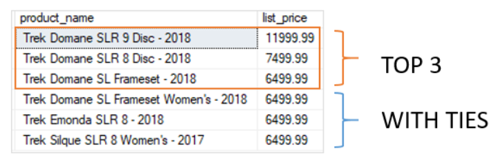

# `SELECT TOP`

---

- [About `WITH TIES`](#about-with-ties)
- [Examples `SELECT TOP`](#examples-select-top)

---

- Limit the number of rows returned by a query
- A special case of `OFFSET/FETCH`
- Only returns the `TOP n` or `TOP n PERCENT` of the result set
- **Note: Because the order of rows stored in a table is unspecified, the `SELECT TOP` statement should always be used in conjunction with the `ORDER BY` clause, similar to `OFFSET/FETCH`**

```sql
SELECT TOP n [PERCENT] [WITH TIES]
       Col_1,
       Col_2,
       Col_3
  FROM Schema_Name.Table_Name
 ORDER BY Col_1;
```

- The `SELECT` statement can have other clauses
- `TOP n`
  - Specifies the number of rows to be returned
  - Could be any expressions that returns a float or an int
  - Evaluated to a `FLOAT` value if `PERCENT` is used
  - Otherwise evaluated to a `BIGINT`
- `TOP n PERCENT`
  - The query returns the first `n%` of rows
  - `n` is evaluated to a `FLOAT` value
- `WITH TIES`
  - If there are tied values, return more rows with values that match the last row in the limited result set
  - Might cause more rows to be returned than you specify with `n`

## About `WITH TIES`

- For example, if you want to return the top 3 most expensive products, you can use the `TOP 3`
  - However, if two or more products have the same prices as the most expensive product, then you miss the other most expensive products in the result set
- To avoid this, you can use `TOP 3 WITH TIES`
  - It will include not only the first most expensive product but also the second tied one, and so on



## Examples `SELECT TOP`

- We can use `SELECT TOP` with a constant value

```sql
SELECT TOP 10
       Product_Name,
       List_Price
  FROM Production.Products
 ORDER BY List_Price DESC;
```

- We can use `PERCENT` to specify the number of products returned in the result set
- If the result is a float, it is rounded to the next integer

```sql
SELECT TOP 1 PERCENT
       Product_Name,
       List_Price
  FROM Production.Products
 ORDER BY List_Price DESC;
```

- We can use `WITH TIES` to include any rows that match the values in the last row (ties)

```sql
SELECT TOP 3 WITH TIES
       Product_Name,
       List_Price
  FROM Production.Products
 ORDER BY List_Price DESC;
```
