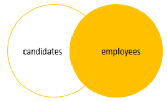
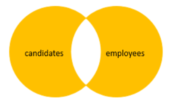

# Joins Overview

---

- [Inner Join Overview](#inner-join-overview)
  - [Inner Join Example](#inner-join-example)
  - [Inner Join Example Venn Diagram](#inner-join-example-venn-diagram)
- [Left Join / Left Outer Join Overview](#left-join--left-outer-join-overview)
  - [Left Join Example](#left-join-example)
  - [Left Join Example Venn Diagram](#left-join-example-venn-diagram)
  - [Exclusive Left Join](#exclusive-left-join)
  - [Exclusive Left Join Example Venn Diagram](#exclusive-left-join-example-venn-diagram)
- [Right Join / Right Outer Join Overview](#right-join--right-outer-join-overview)
  - [Right Join Example](#right-join-example)
  - [Right Join Example Venn Diagram](#right-join-example-venn-diagram)
  - [Exclusive Right Join](#exclusive-right-join)
  - [Exclusive Right Join Example Venn Diagram](#exclusive-right-join-example-venn-diagram)
- [Full Join / Full Outer Join Overview](#full-join--full-outer-join-overview)
  - [Full Join Example](#full-join-example)
  - [Full Join Example Venn Diagram](#full-join-example-venn-diagram)
  - [Exclusive Full Join](#exclusive-full-join)
  - [Exclusive Full Join Example Venn Diagram](#exclusive-full-join-example-venn-diagram)

---

- In RDBMS, data are distributed across multiple logical tables
- To get complete sets of data, we need to query over multiple tables and join their columns together

## Inner Join Overview

- Join two tables on some columns
- Only includes rows which have matching rows from both tables
- `INNER JOIN` is the same as `JOIN`

```sql
SELECT t1.col1,
       t1.col2,
       t2.col1,
       t2.col2
  FROM table1 AS t1
 INNER JOIN table2 AS t2
         ON t1.col1 = t2.col2;

SELECT t1.col1,
       t1.col2,
       t2.col1,
       t2.col2
  FROM table1 AS t1
       JOIN table2 AS t2
         ON t1.col1 = t2.col2;
```

### Inner Join Example

```sql
SELECT C.Id        AS Candidate_Id,
       C.Full_Name AS Candidate_Name,
       E.Id        AS Employee_Id,
       E.Full_Name AS Employee_Name
  FROM hr.Candidates AS C
       JOIN hr.Employees AS E
         ON C.Full_Name = E.Full_Name;
```

### Inner Join Example Venn Diagram


## Left Join / Left Outer Join Overview

- Join two tables on a column
- Include all rows from the left table that meet the predicate
- Only includes rows from the right table which have matching rows from the left table
- If a row in the left table does not have a matching row in the right table, the columns of the right table will have `NULL`

```sql
SELECT t1.col1,
       t1.col2,
       t2.col1,
       t2.col2
  FROM table1 AS t1
  LEFT JOIN table2 AS t2
         ON t1.col1 = t2.col2;
```

### Left Join Example

```sql
SELECT C.Id        AS Candidate_Id,
       C.Full_Name AS Candidate_Name,
       E.Id        AS Employee_Id,
       E.Full_Name AS Employee_Name
  FROM hr.Candidates AS C
  LEFT JOIN hr.Employees AS E
         ON C.Full_Name = E.Full_Name;
```

### Left Join Example Venn Diagram


### Exclusive Left Join

- We can get rows that are only in the left table but not in the right table by applying a `WHERE` condition with `NULL`

```sql
SELECT C.Id        AS Candidate_Id,
       C.Full_Name AS Candidate_Name,
       E.Id        AS Employee_Id,
       E.Full_Name AS Employee_Name
  FROM hr.Candidates AS C
  LEFT JOIN hr.Employees AS E
         ON C.Full_Name = E.Full_Name
 WHERE E.Id IS NULL;
```

### Exclusive Left Join Example Venn Diagram


## Right Join / Right Outer Join Overview

- Join two tables on a column
- Include everything from the right table
- Only includes rows from the left table which have matching rows from the right table
- If a row in the right table does not have a matching row in the left table, the columns of the left table will have `NULL`
- **Right join is the same as left join with swapped table order**

```sql
SELECT t1.col1,
       t1.col2,
       t2.col1,
       t2.col2
  FROM table1 AS t1
 RIGHT JOIN table2 AS t2
         ON t1.col1 = t2.col2;
```

### Right Join Example

```sql
SELECT C.Id        AS Candidate_Id,
       C.Full_Name AS Candidate_Name,
       E.Id        AS Employee_Id,
       E.Full_Name AS Employee_Name
  FROM hr.Candidates AS C
 RIGHT JOIN hr.Employees AS E
         ON C.Full_Name = E.Full_Name;
```

### Right Join Example Venn Diagram



### Exclusive Right Join

- We can get rows only in the right table but not in the left table by applying a `WHERE` condition with `NULL`

```sql
SELECT C.Id        AS Candidate_Id,
       C.Full_Name AS Candidate_Name,
       E.Id        AS Employee_Id,
       E.Full_Name AS Employee_Name
  FROM hr.Candidates AS C
 RIGHT JOIN hr.Employees AS E
         ON C.Full_Name = E.Full_Name
 WHERE C.Id IS NULL;
```

### Exclusive Right Join Example Venn Diagram


## Full Join / Full Outer Join Overview

- Join two tables on a column
- Include everything from both table
- If a row in the right table does not have a matching row in the left table, the columns of the left table will have `NULL`
- If a row in the left table does not have a matching row in the right table, the columns of the right table will have `NULL`

```sql
SELECT t1.col1,
       t1.col2,
       t2.col1,
       t2.col2
  FROM table1 AS t1
  FULL JOIN table2 AS t2
         ON t1.col1 = t2.col2;
```

### Full Join Example

```sql
SELECT C.Id        AS Candidate_Id,
       C.Full_Name AS Candidate_Name,
       E.Id        AS Employee_Id,
       E.Full_Name AS Employee_Name
  FROM hr.Candidates AS C
  FULL JOIN hr.Employees AS E
         ON C.Full_Name = E.Full_Name;
```

### Full Join Example Venn Diagram


### Exclusive Full Join

- We can get rows only in either the Left or Right table but not in the intersection by applying a `WHERE` condition with `NULL`

```sql
SELECT C.Id        AS Candidate_Id,
       C.Full_Name AS Candidate_Name,
       E.Id        AS Employee_Id,
       E.Full_Name AS Employee_Name
  FROM hr.Candidates AS C
  FULL JOIN hr.Employees AS E
         ON C.Full_Name = E.Full_Name;
 WHERE C.Id IS NULL
       OR E.Id IS NULL;
```

### Exclusive Full Join Example Venn Diagram


