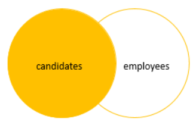

# `LEFT JOIN`/`LEFT OUTER JOIN`

---

- [Format](#format)
- [Figure Explanations](#figure-explanations)
- [Example of Left Join](#example-of-left-join)
- [Conditions in `WHERE` vs in `ON` clause](#conditions-in-where-vs-in-on-clause)
  - [Case in `WHERE`: Finds the `Products` that belong to the `Order` id 100](#case-in-where-finds-the-products-that-belong-to-the-order-id-100)
  - [Case in `ON`: Return all `Products` but only the `Order` with id 100 has the associated order information](#case-in-on-return-all-products-but-only-the-order-with-id-100-has-the-associated-order-information)
  - [Exclusive Left Join](#exclusive-left-join)
  - [Left Join Exclusive Figure Explanation](#left-join-exclusive-figure-explanation)

---

- Join two or more tables on a column
- Returns all rows from the left table and matching rows or `NULL` values from the right table
- **Left-Priority**

## Format

```sql
SELECT select_list
  FROM T1
  LEFT JOIN T2
         ON join_predicate;
```

- Include all rows from the left table that meet the predicate
- Only includes rows from the right table which have matching rows from the left table
- If a row in the left table does not have a matching row in the right table, the columns of the right table will have `NULL`

## Figure Explanations




## Example of Left Join

```sql
SELECT P.Product_Name,
       OI.Order_Id
  FROM Production.Products AS P
  LEFT JOIN Sales.Order_Items AS OI
         ON P.Product_Id = OI.Product_Id
 ORDER BY OI.Order_Id;
```

- We can run left join on multiple tables at once

```sql
SELECT P.Product_Name,
       O.Order_Id,
       OI.Item_Id,
       O.Order_Date
  FROM Production.Products AS P
  LEFT JOIN Sales.Order_Items AS OI
         ON P.Product_Id = OI.Product_Id
  LEFT JOIN Sales.Orders AS O
         ON OI.Order_Id = O.Order_Id
 ORDER BY OI.Order_Id;
```

## Conditions in `WHERE` vs in `ON` clause

- Conditions could be added on either `ON` or `WHERE`
- Normally, filtering is processed in the `WHERE` clause once the two tables have already been joined
- It is possible though that you might want to filter one or both of the tables before joining them
  - The `WHERE` clause applies to the whole result set
  - The `ON` clause only applies to the join in question
- **Each one would have a different result**

### Case in `WHERE`: Finds the `Products` that belong to the `Order` id 100

- Strict Condition: Excluded all orders where the `Order_Id` does not match the condition given value

```sql
SELECT P.Product_Id,
       P.Product_Name,
       OI.Order_Id
  FROM Production.Products AS P
  LEFT JOIN Sales.Order_Items AS OI
         ON P.Product_Id = OI.Product_Id
 WHERE OI.Order_Id = 100
 ORDER BY OI.Order_Id DESC;
```

### Case in `ON`: Return all `Products` but only the `Order` with id 100 has the associated order information

- Flexible Condition: Substitute with `NULL` where `Order_Id` does not match the condition given value

```sql
SELECT P.Product_Id,
       P.Product_Name,
       OI.Order_Id
  FROM Production.Products AS P
  LEFT JOIN Sales.Order_Items AS OI
         ON P.Product_Id = OI.Product_Id
        AND OI.Order_Id = 100
 ORDER BY OI.Order_Id DESC;
```

### Exclusive Left Join

- We can get rows only in the left table but not in the right table by applying a `WHERE` condition with `NULL`
- **This is a `MINUS` set operation**

```sql
SELECT P.Product_Id,
       P.Product_Name,
       OI.Order_Id
  FROM Production.Products AS P
  LEFT JOIN Sales.Order_Items AS OI
         ON P.Product_Id = OI.Product_Id
 WHERE OI.Order_Id IS NULL
 ORDER BY OI.Order_Id;
```

- **SQL Server processes the `WHERE` clause after the `LEFT JOIN` clause**

### Left Join Exclusive Figure Explanation


