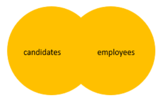

# `FULL JOIN`/`FULL OUTER JOIN`

- Returns a result set that includes all rows from both left and right tables
- When no matching rows exist for the row in any table, the columns of the opposite table will have `NULL`

## Format

`OUTER` keyword is optional

```sql
SELECT select_list
FROM T1 FULL OUTER JOIN T2 
    ON join_predicate;

SELECT select_list
FROM T1 FULL JOIN T2 
    ON join_predicate;
```

## Figure Explanations



## Example of Full Join

```sql
SELECT
    Product_Name,
    Order_Id
FROM Production.Products AS P 
FULL JOIN Sales.Order_Items AS OI 
    ON OI.Product_Id = P.Product_Id
ORDER BY Order_Id;
```

### Exclusive Full Join

- We can get rows only in the right table or left tabel but not in the intersection by applying a `WHERE` condition with `NULL`
- This could be considered a complement of `INNER JOIN` with the right conditions

```sql
SELECT
    Product_Name,
    Order_Id
FROM Production.Products AS P 
FULL JOIN Sales.Order_Items AS OI 
    ON OI.Product_Id = P.Product_Id
WHERE OI.Order_Id IS NULL
    OR P.Product_Name IS NULL
ORDER BY Order_Id;
```

If we apply `IS NOT NULL` instead, we get the same result as `INNER JOIN`

```sql
SELECT
    Product_Name,
    Order_Id
FROM Production.Products AS P 
FULL JOIN Sales.Order_Items AS OI 
    ON OI.Product_Id = P.Product_Id
WHERE OI.Order_Id IS NOT NULL
    AND P.Product_Name IS NOT NULL
ORDER BY Order_Id;
```

This is the same as

```sql
SELECT
    Product_Name,
    Order_Id
FROM Production.Products AS P 
INNER JOIN Sales.Order_Items AS OI 
    ON OI.Product_Id = P.Product_Id
ORDER BY Order_Id;
```
