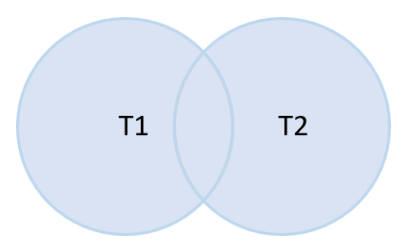
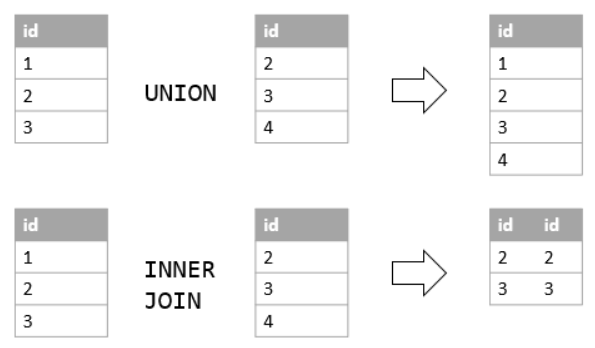

# `UNION` and `UNION ALL`

- Combines the result sets of multiple `SELECT` queries into one
- Include all the rows that belongs to the `SELECT` statements in the union
- There are 2 requirements:
  - **Number and order of columns must be the same in both queries**
  - **Data types of the corresponding columns must be the same or compatible**

## Format

```sql
SELECT Columns from Table1
UNION
SELECT Columns from Table2
```

## Figure Explanations



## `UNION ALL` 

- By default, `UNION` removes all duplicate rows from the result sets
- To retain the duplicate rows, specify the `ALL` keyword explicitly

### Format

```sql
SELECT Columns from Table1
UNION ALL
SELECT Columns from Table2
```

## `UNION` vs `JOIN`

- Joins append the result sets horizontally
- Unions append result sets vertically



## Examples of `UNION` and `UNION ALL`

Combine names of `Staffs` and `Customers` into a single list

```sql
SELECT
    First_Name,
    Last_Name
FROM Sales.Staffs
--Returns 10 rows
UNION
SELECT
    First_Name,
    Last_Name
FROM Sales.Customers;
--Returns 1454 rows
```

Combine names of `Staffs` and `Customers` into a single list, including all duplicates

```sql
SELECT
    First_Name,
    Last_Name
FROM Sales.Staffs
--Returns 10 rows
UNION ALL
SELECT
    First_Name,
    Last_Name
FROM Sales.Customers;
--Returns 1454 rows
```

### Using `UNION` with `ORDER BY`

`ORDER BY` goes last

```sql
SELECT
    First_Name,
    Last_Name
FROM Sales.Staffs
--Returns 10 rows
UNION ALL
SELECT
    First_Name,
    Last_Name
FROM Sales.Customers
--Returns 1454 rows
ORDER BY
    First_Name,
    Last_Name;
```