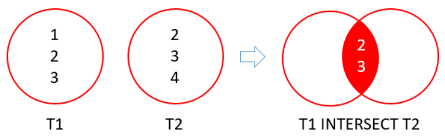

# `INTERSECT`

---

- [Format](#format)
- [Figure Explanations](#figure-explanations)
- [Example of `INTERSECT`](#example-of-intersect)

---

- Return the intersection of the result sets of two or more queries
- Return distinct rows that appear in both
- There are 2 requirements:
  - **Number and order of columns must be the same in both queries**
  - **Data types of the corresponding columns must be the same or compatible**

## Format

```sql
   SELECT Columns
     FROM Table1
INTERSECT
   SELECT Columns
     FROM Table2
```

## Figure Explanations



## Example of `INTERSECT`

- Return the common cities between Customers' cities and Stores' cities

```sql
   SELECT City
     FROM Sales.Customers
INTERSECT
   SELECT City
     FROM Sales.Stores
    ORDER BY City;
```
