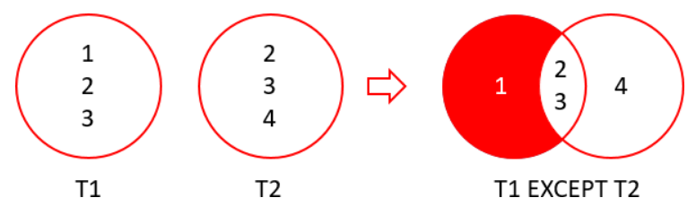

# `EXCEPT`

---

- [Format](#format)
- [Figure Explanations](#figure-explanations)
- [Examples of `EXCEPT`](#examples-of-except)
  - [Using `EXCEPT` with `ORDER BY`](#using-except-with-order-by)

---

- Find the difference between the two result sets of two input queries
- Subtract a result set of a query from another result set of another query
- Returns the **distinct** rows from the first query that are not output by the second query
- There are 2 requirements:
  - **Number and order of columns must be the same in both queries**
  - **Data types of the corresponding columns must be the same or compatible**

## Format

```sql
SELECT Columns
  FROM Table1
EXCEPT
SELECT Columns
  FROM Table2
```

## Figure Explanations



## Examples of `EXCEPT`

- Find the products that have no sales

```sql
SELECT Product_Id
  FROM Production.Products
EXCEPT
SELECT Product_Id
  FROM Sales.Order_Items;
```

### Using `EXCEPT` with `ORDER BY`

- `ORDER BY` goes last

```sql
SELECT Product_Id
  FROM Production.Products
EXCEPT
SELECT Product_Id
  FROM Sales.Order_Items
 ORDER BY Product_Id;
```
