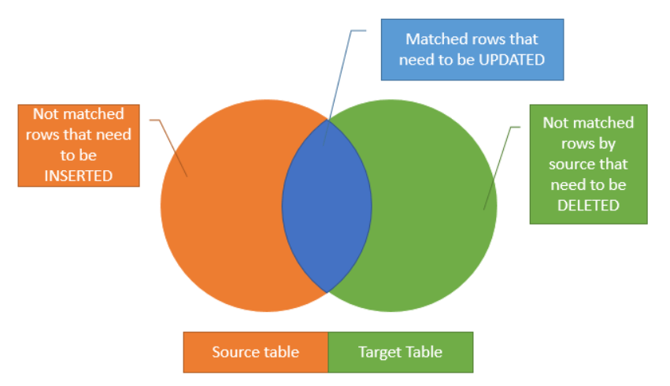

# `MERGE`

- Update data in a table (Target) based on a values matched from another table (Source)
- Allows to fully synchronize 2 tables
- 3 cases:
  - The Source table has some rows that do not exist in the Target table --> `INSERT`
  - The Target table has some rows that do not exist in the Source table --> `DELETE`
  - The Source table has some rows with the same keys as the rows in the Target table --> `UPDATE`



- We could use `INSERT`, `UPDATE`, `DELETE` separately to make this work
- However, we have the option `MERGE` to make it happen all at once

```sql
MERGE Target_Table USING Source_Table ON merge_condition
WHEN MATCHED THEN update_statement
WHEN NOT MATCHED THEN insert_statement
WHEN NOT MATCHED BY SOURCE THEN DELETE;
```

- Specify the `Target` table and the `Source` table in the `MERGE` clause
- The `merge_condition` determines how the rows from the `Source` table are matched to the rows from the `Target` table
  - Similar to the `join_condition` in the `Join` clause
- The `merge_condition` results in three possible states:
  - `MATCHED`: 
    - Rows that match the merge condition
    - Update the rows columns in the `Target` table with values from the `Source` table
  - `NOT MATCHED / NOT MATCHED BY TARGET`: 
    - Rows from the `Source` table that do not have matching rows in the `Target` table
    - Add the rows from the `Source` table to the `Target` table
  - `NOT MATCHED BY SOURCE`: 
    - Rows in the `Target` table that do not match any rows in the `Source` table
    - To synchronize the `Target` table with the data from the `Source` table, use this match condition to delete rows from the `Target` table

## Examples of `MERGE`

Let's create some tables for demonstration

```sql
CREATE TABLE Sales.Category (
    Category_Id INT PRIMARY KEY,
    Category_Name VARCHAR(255) NOT NULL,
    Amount DECIMAL(10 , 2 )
);

INSERT INTO Sales.Category(Category_Id, Category_Name, Amount)
VALUES
    (1,'Children Bicycles',15000),
    (2,'Comfort Bicycles',25000),
    (3,'Cruisers Bicycles',13000),
    (4,'Cyclocross Bicycles',10000);

CREATE TABLE Sales.Category_Staging (
    Category_Id INT PRIMARY KEY,
    Category_Name VARCHAR(255) NOT NULL,
    Amount DECIMAL(10 , 2 )
);

INSERT INTO Sales.Category_Staging(Category_Id, Category_Name, Amount)
VALUES
    (1,'Children Bicycles',15000),
    (3,'Cruisers Bicycles',13000),
    (4,'Cyclocross Bicycles',20000),
    (5,'Electric Bikes',10000),
    (6,'Mountain Bikes',10000);
```

- Target Table: `Sales.Category`
- Source Table: `Sales.Category_Staging`

```sql
MERGE Sales.Category T USING Sales.Category_Staging S
    ON (S.Category_Id = T.Category_Id)
WHEN MATCHED 
    THEN UPDATE SET 
        T.Category_Name = S.Category_Name,
        T.Amount = S.Amount
WHEN NOT MATCHED BY TARGET 
    THEN INSERT (Category_Id, Category_Name, Amount)
         VALUES (S.Category_Id, S.Category_Name, S.Amount)
WHEN NOT MATCHED BY SOURCE 
    THEN DELETE;
```

