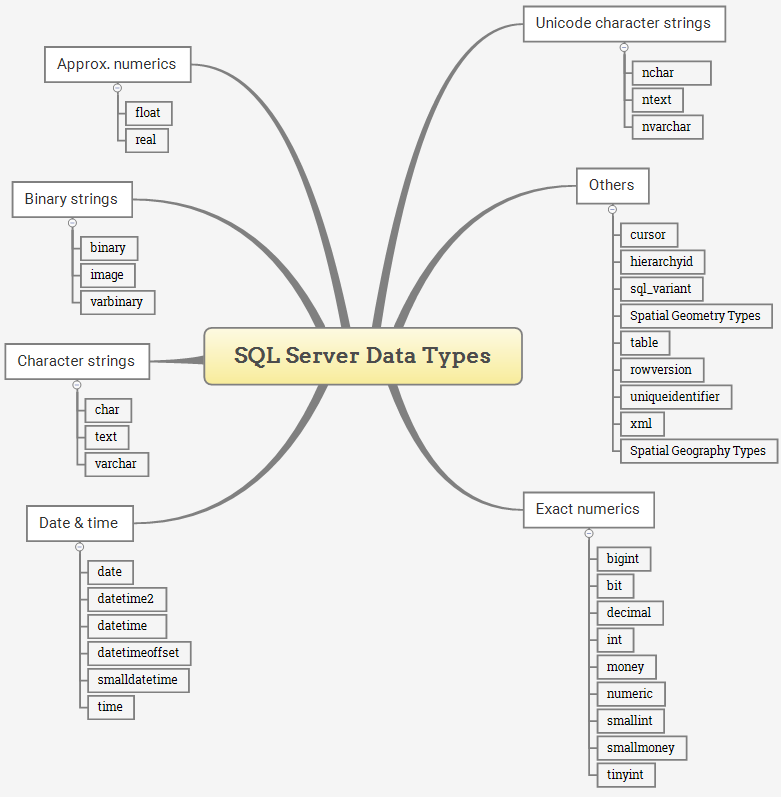

# T-SQL Data Types

---

- [Overview](#overview)
- [Exact Numeric Types](#exact-numeric-types)
- [Approximate Numeric Types](#approximate-numeric-types)
- [Date and Time Types](#date-and-time-types)
- [Character Strings](#character-strings)
- [Unicode Character Strings](#unicode-character-strings)
- [Binary Strings](#binary-strings)
- [Other Data Types](#other-data-types)
- [Notes](#notes)
- [User-Defined Types](#user-defined-types)
- [Types Combination Rule](#types-combination-rule)

---

## Overview

- A column, variable, and parameter holds a value that is associated with a type
- Attribute that specifies the type of data that these objects can store
- A set of system data types that define all the types of data that can be used with SQL Server
- Alias data types are based on the system-supplied data types
- Organized in as follows:
  - Exact numerics
  - Approximate numerics
  - Date and time
  - Character strings
  - Unicode character strings
  - Binary strings
  - Other data types

- **NOTE:**
  - **`ntext`, `text`, and `image` will be removed in future versions**
  - **Use `nvarchar(max)`, `varchar(max)`, and `varbinary(max)` instead**

## Exact Numeric Types

- Store exact numbers

|Type|From|To|Storage
|:--:|:--:|:-:|:-----:
|`bit`|`0`|`1`|1 Byte/8 bits
|`tinyint`|`0`|`255`|1 Byte/8 bits
|`smallint`|`-32,768`|`32,767`|2 Bytes/16 bits
|`int`|`-2,147,483,648`|`2,147,483,647`|4 Bytes/32 bits
|`bigint`|`-9,223,372,036,854,775,808`| `9,223,372,036,854,775,807`|8 Bytes/64 bits
|`decimal`|`-10^38 +1`|`10^38 –1`|5 to 17 Bytes
|`numeric`|`-10^38 +1`|`10^38 –1`|5 to 17 Bytes
|`smallmoney`|`-214,748.3648`|`+214,748.3647`|4 Bytes/32 bits
|`money`|`-922,337,203,685,477.5808`|`+922,337,203,685,477.5807`|8 Bytes/64 bits

## Approximate Numeric Types

- Store floating-point numeric data
- Often used in scientific calculations

|Type|From|To|Precision
|:--:|:--:|:-:|:-------:
|`Float`|`-1.79E+308`|`1.79E+308`|7 Digit
|`Real`|`-3.40E+38`|`3.40E+38`|15 Digit

## Date and Time Types

|Type|From|To|Storage Size|Accuracy
|:--:|:--:|:-:|:----------:|:------:
`datetime`|`1753-01-01`|`9999-12-31`|8 Bytes|3.33 milliseconds
`smalldatetime`|`1900-01-01`|`2079-06-06`|4 Bytes|1 minute
`date`|`0001-01-01`|`9999-12-31`|3 Bytes|1 day
`time`|`00:00:00.0000000`|`23:59:59.9999999`|5 Bytes|100 nanoseconds
`datetimeoffset`|`0001-01-01`|`9999-12-31`|10 Bytes|100 nanoseconds
`datetime2`|`0001-01-01`|`9999-12-31`|6 Bytes|100 nanoseconds

- For new applications, use `time`, `date`, `datetime2` and `datetimeoffset`
  - Align with the SQL Standard and more portable
  - Have more seconds precision
  - `datetimeoffset` supports time zone

## Character Strings

- Store either fixed-length (`char`) or variable-length data (`varchar`)
- `text` can store non-Unicode data

Type|Lower Bound|Upper Bound|Description
:--:|:---------:|:---------:|:---------:
`char`|0 Chars|8000 Chars|Fixed-length non-Unicode character data
`varchar`|0 Chars|8000 Chars|Variable-length non-Unicode data
`varchar(max)`|0 Chars|2^31 Chars|Variable-length non-Unicode data
`text`|0 Chars|2^31-1 Chars|Variable-length non-Unicode data

- **NOTE**
  - **`text` will be removed in future versions**
  - **Use `varchar(max)` instead**

## Unicode Character Strings

- Store either fixed-length (`nchar`) or variable-length (`nvarchar`) Unicode character data

Type|Lower Bound|Upper Bound|Description
:--:|:---------:|:---------:|:---------:
`nchar`|0 Chars|4000 Chars|Fixed-length Unicode data
`nvarchar`|0 Chars|4000 Chars|Variable-length Unicode data
`nvarchar(max)`|0 Chars|2^30 Chars|Variable-length Unicode data
`ntext`|0 Chars|2^30 Chars|Variable-length Unicode data

- **NOTE**
  - **`ntext` will be removed in future versions**
  - **Use `nvarchar(max)` instead**

## Binary Strings

- Stores fixed and variable length binary data

Type|Lower Bound|Upper Bound|Description
:--:|:---------:|:---------:|:---------:
`binary`|0 Bytes|8000 Bytes|Fixed-length binary data
`varbinary`|0 Bytes|8000 Bytes|Variable-length binary data
`varbinary(max)`|0 Bytes|2^31-1 Bytes|Variable-length binary data
`image`|0 Bytes|2^31-1 Bytes|Variable-length binary data

- **NOTE**
  - **`image` will be removed in future versions**
  - **Use `varbinary(max)` instead**

## Other Data Types

Type|Description
:--:|:---------:
`cursor`|A reference to a cursor
`geometry`|Represent spatial data in a flat coordinate system
`geography`|Store ellipsoidal (round-earth) data, such as GPS latitude and longitude coordinates
`hierarchyid`|A variable length, system data type used to represent position in a hierarchy (Introduced in SQL Server 2008)
`rowversion`|Expose automatically-generated, unique binary numbers within a database
`sql_variant`|Stores values of various SQL Server-supported data types, except text, ntext, and timestamp
`table`|Stores a result set temporarily for later processing
`timestamp`|Stores a database-wide unique number that gets updated every time a row gets updated
`uniqueidentifier`|Stores a globally unique identifier (GUID)
`xml`|Stores XML data. You can store XML instances in a column or a variable (Introduced in SQL Server 2005)

## Notes

- Based on their storage characteristics, some data types are designated as belonging to the following groups:
  - **Large value data types**
    - `varchar(max)`
    - `nvarchar(max)`
  - **Large object data types**
    - `text`
    - `ntext`
    - `image`
    - `varbinary(max)`
    - `xml`
- `sp_help` returns `-1` as the *length* for the *large-value* and `xml` data types

## User-Defined Types

- Can also define custom data types in Transact-SQL or Microsoft .NET
  - Using `CREATE TYPE`
- User-defined types obtain their characteristics from the methods and operators of a .NET class
  - Create class by using one of the programming languages support by .NET

## Types Combination Rule

- When expressions with different data types, collations, precision, scale, or length are combined by an operator, the characteristics of result are determined by the following
  - **T-SQL Data Type Precedence**: Apply the rules of data type precedence to the data types of the input expressions
  - **T-SQL Collation Precedence**: Determined by the rules of collation precedence when the result data type is `char`, `varchar`, `text`, `nchar`, `nvarchar`, or `ntext`
  - **T-SQL Precision, Scale, and Length**: Depend on the precision, scale, and length of the input expressions
