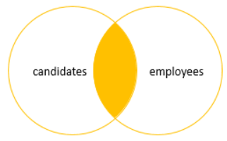
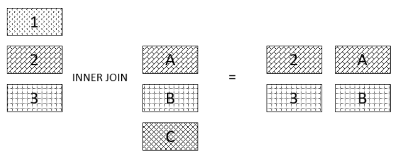

# `INNER JOIN`

- One of the most commonly used joins in SQL Server
- Query data from two or more related tables
- **`INNER` keyword is optional: Default join is `INNER`**

## Format

```sql
SELECT select_list
FROM T1 [INNER] JOIN T2 
    ON join_predicate;
```

- Only rows that cause the join predicate to evaluate to `TRUE` are included in the result set
- Compares each row of the table `T1` with rows of table `T2`
- Find all pairs of rows that satisfy the join predicate
- Column values of the matching rows of `T1` and `T2` are combined into a new row and included in the result set

## Figure Explanations




## Example of Inner Join

```sql
SELECT
    product_name,
    category_name,
    list_price
FROM production.products AS p INNER JOIN production.categories AS c 
    ON c.category_id = p.category_id
ORDER BY product_name DESC;
```

We can run inner join on multiple tables at once

```sql
SELECT
    product_name,
    category_name,
    brand_name,
    list_price
FROM production.products AS p 
    JOIN production.categories AS c ON c.category_id = p.category_id
    JOIN production.brands AS b ON b.brand_id = p.brand_id
ORDER BY product_name DESC;
```

## Conditions in `WHERE` vs in `ON` clause

- Normally, filtering is processed in the `WHERE` clause once the two tables have already been joined
- It is possible though that you might want to filter one or both of the tables before joining them
  - The `WHERE` clause applies to the whole result set (after join)
  - The `ON` clause only applies while the tables are being joined
- **For `INNER JOIN`, additional conditions in `ON` is functionally equivalent if it is placed in the `WHERE` clause**

```sql
SELECT *
FROM sales.customers AS c JOIN sales.orders AS o 
    ON c.customer_Id = o.customer_Id
WHERE c.customer_Id = 1
    AND o.order_Id > 1000;
```

Which is functionally equivalent to

```sql
SELECT *
FROM sales.customers AS c JOIN sales.orders AS o 
    ON c.customer_Id = o.customer_Id
    AND c.customer_Id = 1
    AND o.order_Id > 1000;
```
