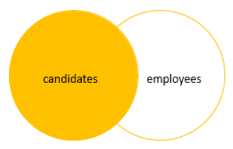
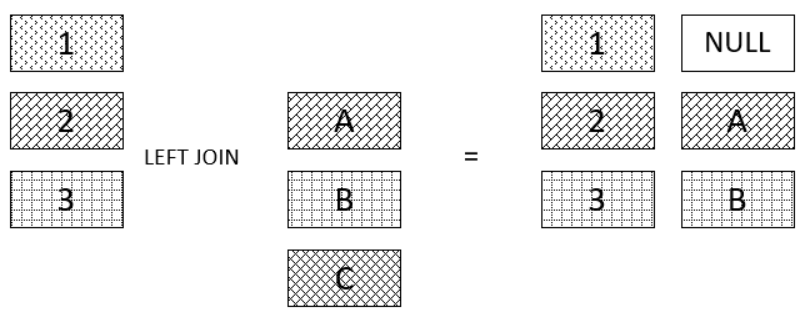
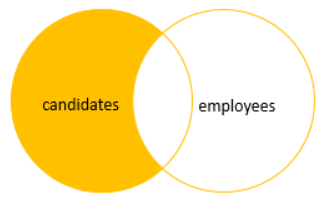

# `LEFT JOIN`/`LEFT OUTER JOIN`

- Join two or more tables on a column
- Returns all rows from the left table and matching rows or `NULL` values from the right table

## Format

```sql
SELECT select_list
FROM T1 LEFT JOIN T2 
    ON join_predicate;
```

- Include all rows from the left table that meet the predicate
- Only includes rows from the right table which have matching rows from the left table
- If a row in the left table does not have a matching row in the right table, the columns of the right table will have `NULL`

## Figure Explanations




## Example of Left Join

```sql
SELECT
    product_name,
    order_id
FROM production.products p LEFT JOIN sales.order_items o 
    ON o.product_id = p.product_id
ORDER BY order_id;
```

We can run left join on multiple tables at once

```sql
SELECT
    p.product_name,
    o.order_id,
    i.item_id,
    o.order_date
FROM production.products p 
    LEFT JOIN sales.order_items i ON i.product_id = p.product_id
    LEFT JOIN sales.orders o ON o.order_id = i.order_id
ORDER BY order_id;
```

## Conditions in `WHERE` vs in `ON` clause

- Conditions could be added on either `ON` or `WHERE`
- Normally, filtering is processed in the `WHERE` clause once the two tables have already been joined
- It is possible though that you might want to filter one or both of the tables before joining them
  - The `WHERE` clause applies to the whole result set
  - The `ON` clause only applies to the join in question
- **Each one would have a different result**

### Case in `WHERE`: Finds the `products` that belong to the `order` id 100

Strict Condition: Excluded all orders where the `order_id` does not match

```sql
SELECT
    product_name,
    order_id
FROM production.products p LEFT JOIN sales.order_items o 
    ON o.product_id = p.product_id
WHERE order_id = 100
ORDER BY order_id DESC;
```

### Case in `ON`: Return all `products` but only the `order` with id 100 has the associated order information

Flexible Condition: Substitute with `NULL` where `order_id` does not match the condition

```sql
SELECT
    p.product_id,
    product_name,
    order_id
FROM production.products p LEFT JOIN sales.order_items o 
    ON o.product_id = p.product_id 
    AND o.order_id = 100
ORDER BY order_id DESC;
```

### Exclusive Left Join

- We can get rows only in the left table but not in the right table by applying a `WHERE` condition with `NULL`
- **This is a `MINUS` set operation**

```sql
SELECT
    product_name,
    order_id
FROM production.products p LEFT JOIN sales.order_items o 
    ON o.product_id = p.product_id
WHERE order_id IS NULL
ORDER BY order_id;
```

- **SQL Server processes the `WHERE` clause after the `LEFT JOIN` clause**

### Left Join Exclusive Figure Explanation


