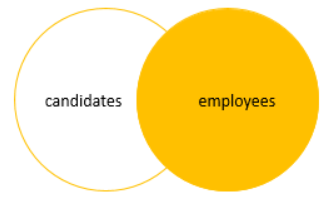
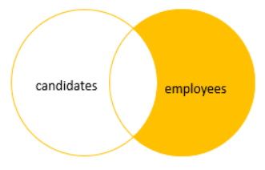

# `RIGHT JOIN`/`RIGHT OUTER JOIN`

- Join two or more tables on a column
- Returns all rows from the right table and matching rows or `NULL` values from the left table
- **It is the same as left join with the order of the tables swapped**

## Format

```sql
SELECT select_list
FROM T1 RIGHT JOIN T2 
    ON join_predicate;
```

- Include all rows from the right table that meet the predicate
- Only includes rows from the left table which have matching rows from the right table
- If a row in the right table does not have a matching row in the left table, the columns of the left table will have `NULL`

## Figure Explanations



## Example of Right Join

```sql
SELECT
    product_name,
    order_id
FROM production.products p RIGHT JOIN sales.order_items o 
    ON o.product_id = p.product_id
ORDER BY order_id;
```

We can run right join on multiple tables at once

```sql
SELECT
    p.product_name,
    o.order_id,
    i.item_id,
    o.order_date
FROM production.products p 
    RIGHT JOIN sales.order_items i ON i.product_id = p.product_id
    RIGHT JOIN sales.orders o ON o.order_id = i.order_id
ORDER BY order_id;
```

## Conditions in `WHERE` vs in `ON` clause

- Conditions could be added on either `ON` or `WHERE`
- Each one would have a different result

**Case in `WHERE`: Finds the `products` that belong to the `order` id 100**

```sql
SELECT
    product_name,
    order_id
FROM production.products p RIGHT JOIN sales.order_items o 
    ON o.product_id = p.product_id
WHERE order_id = 100
ORDER BY order_id;
```

**Case in `ON`: Return all `orders` but only the `products` with id > 100 has the associated product's information**

```sql
SELECT
    p.product_id,
    product_name,
    order_id
FROM production.products p RIGHT JOIN sales.order_items o 
    ON o.product_id = p.product_id 
    AND o.product_id > 100
ORDER BY order_id DESC;
```

### Exclusive Right Join

- We can get rows only in the right table but not in the left table by applying a `WHERE` condition with `NULL`

```sql
SELECT
    product_name,
    order_id
FROM sales.order_items o RIGHT JOIN production.products p 
    ON o.product_id = p.product_id
WHERE order_id IS NULL
ORDER BY product_name;
```

- SQL Server processes the `WHERE` clause after the `RIGHT JOIN` clause

### Right Join Exclusive Figure Explanation


