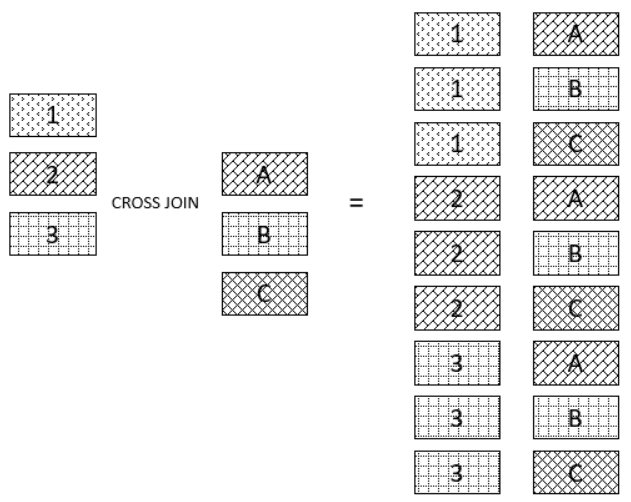

# `CROSS JOIN`

- Returns a Cartesian product of rows from both tables
- Join every single row from the first table with every single row from the second table
- Does not establish a relationship between the joined tables

## Format

```sql
SELECT select_list
FROM T1 CROSS JOIN T2;
```

## Figure Explanations



## Example of Cross Joins

Combinations of all products and stores

```sql
SELECT
    Product_Id,
    Product_Name,
    Store_Id,
    0 AS Quantity -- Giving a default value
FROM Production.Products 
CROSS JOIN Sales.Stores
ORDER BY
    Product_Name,
    Store_Id;
```

Find products that have no sales across the stores

```sql
WITH SPS AS ( -- Store | Product | Sales
    SELECT
        S.Store_Id,
        P.Product_Id,
        SUM (Quantity * OI.List_Price) AS Sales
    FROM Sales.Orders AS O
    INNER JOIN Sales.Order_Items AS OI
        ON OI.Order_Id = O.Order_Id
    INNER JOIN Sales.Stores AS S 
        ON S.Store_Id = O.Store_Id
    INNER JOIN Production.Products AS P 
        ON P.Product_Id = OI.Product_Id
    GROUP BY
        S.Store_Id,
        P.Product_Id
)
SELECT
    S.Store_Id,
    P.Product_Id,
    ISNULL(Sales, 0) AS Sales
FROM Sales.Stores AS S
CROSS JOIN Production.Products AS P
LEFT JOIN SPS
    ON SPS.Store_Id = S.Store_Id
    AND SPS.Product_Id = P.Product_Id
WHERE Sales IS NULL
ORDER BY
    Product_Id,
    Store_Id;
```
