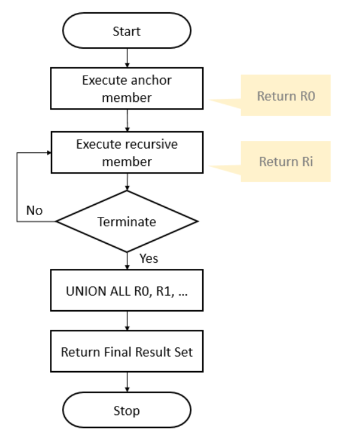

# Recursive CTE

- CTE that references itself
- The CTE repeatedly executes, returns subsets of data, until it returns the complete result set
- Used for querying hierarchical data

## Format

- In general, it has 3 parts:

1. *Initial Query/Anchor Member* - Returns the base result set of the CTE
1. *Recursive Query/Recursive Member* - References the CTE. The Recursive Member is union-ed with the Anchor Member using the `UNION ALL` operator
1. *Termination Condition* - Specified in the recursive member that terminates the execution of the recursive member

```sql
WITH expression_name (column_list) AS (
    initial_query -- Anchor member
    UNION ALL
    recursive_query -- Recursive member that references expression_name
)
-- references expression name
SELECT *
FROM expression_name
```

## Execution Order

1. Execute the *Anchor Member* to form the base result set `R0`: Use this result for the next iteration
2. Execute the *Recursive Member* with the input result set from the previous iteration `Ri-1`: Return a sub-result set `Ri` until the termination condition is met
3. Combine all result sets `R0`, `R1`,... `Rn` using `UNION ALL` operator to produce the final result set

### Figure Explanations



## Examples of Recursive CTE

Returns weekdays from Monday to Saturday

```sql
WITH Cte_Numbers (n, weekday) AS (
    SELECT 
        0, 
        DATENAME(DW, 0)
    UNION ALL
    SELECT    
        n + 1, 
        DATENAME(DW, n + 1)
    FROM Cte_Numbers
    WHERE n < 6
)
SELECT weekday
FROM Cte_Numbers;
```

Get all subordinates of the top manager who does not have a manager (or the value in the `Manager_Id` column is `NULL`)

```sql
WITH Cte_Org AS (
    SELECT       
        Staff_Id, 
        First_Name,
        Manager_Id
    FROM Sales.Staffs
    WHERE Manager_Id IS NULL
    UNION ALL
    SELECT 
        E.Staff_Id, 
        E.First_Name,
        E.Manager_Id
    FROM Sales.Staffs AS E
    INNER JOIN Cte_Org AS O 
        ON O.Staff_Id = E.Manager_Id
)
SELECT * FROM Cte_Org;
```