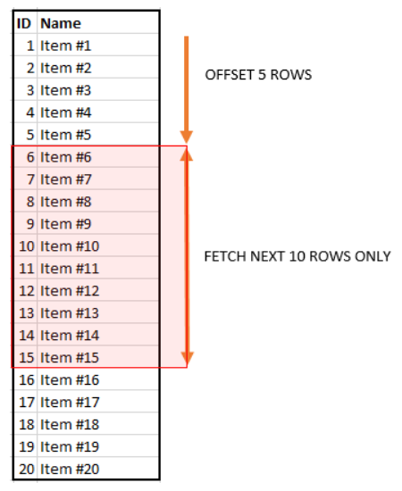

# `OFFSET` & `FETCH`

- Limit the number of rows returned by a query
- Options of `ORDER BY`: **You must use `OFFSET` and `FETCH` with `ORDER BY`**
- `OFFSET` and `FETCH` are preferable for implementing the query paging solution than the `TOP` clause as they are more generalized
- `OFFSET` and `FETCH` have been available since SQL Server 2012 and in Azure SQL Database

```sql
SELECT col1, col2, col3
FROM schema_name.table_name
ORDER BY col1 [ASC|DESC], col2 [ASC|DESC]
OFFSET offset_row_count [ROW|ROWS]
FETCH [FIRST|NEXT] fetch_row_count [ROW|ROWS] ONLY
```

- `OFFSET` - The number of rows to skip before starting to return rows from the query
  - `offset_row_count` - Can be constant, variable, or parameter >= 0
- `FETCH` - The number of rows to return after the `OFFSET` clause has been processed
  - `fetch_row_count` - Can be constant, variable, or parameter >= 0
- `OFFSET` clause is mandatory but the `FETCH` clause is optional
- `FIRST|NEXT` - Aliases
- `ROW|ROWS` - Aliases



## Examples `OFFSET` & `FETCH`

```sql
SELECT product_name, list_price
FROM production.products
ORDER BY list_price DESC, product_name;
```

We can skip the first 10 products and return the rest

```sql
SELECT product_name, list_price
FROM production.products
ORDER BY list_price DESC, product_name
OFFSET 10 ROWS;
```

We can skip the first 10 products and select the next 10 products

```sql
SELECT product_name, list_price
FROM production.products
ORDER BY list_price DESC, product_name
OFFSET 10 ROWS
FETCH NEXT 10 ROWS ONLY;
```

We can get the top 10 most expensive products

```sql
SELECT product_name, list_price
FROM production.products
ORDER BY list_price DESC, product_name
OFFSET 0 ROWS
FETCH FIRST 10 ROWS ONLY;
```

This is the same as using `SELECT TOP`

```sql
SELECT TOP 10 product_name, list_price
FROM production.products
ORDER BY list_price DESC, product_name
```
