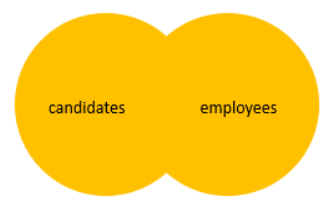

# Full Join / Full Outer Join

- Returns a result set that includes rows from both left and right tables
- When no matching rows exist for the row in any table, the columns of the opposite table will have nulls

## Format

`OUTER` keyword is optional

```sql
SELECT select_list
FROM T1 FULL OUTER JOIN T2 
  ON join_predicate

SELECT select_list
FROM T1 FULL JOIN T2 
  ON join_predicate
```

## Figure Explanations



## Example of Full Join

```sql
SELECT
  product_name,
  order_id
FROM production.products p FULL JOIN sales.order_items o 
  ON o.product_id = p.product_id
ORDER BY order_id
```

### Exclusive Full Join

- We can get row only in the right table or left tabelbut not in the intersection by applying a `WHERE` condition with `NULL`
- This could be considered a complement of `INNER JOIN` with the right conditions

```sql
SELECT
  product_name,
  order_id
FROM production.products p FULL JOIN sales.order_items o 
  ON o.product_id = p.product_id
  WHERE o.order_id IS NULL
    OR p.product_name IS NULL
ORDER BY order_id
```
