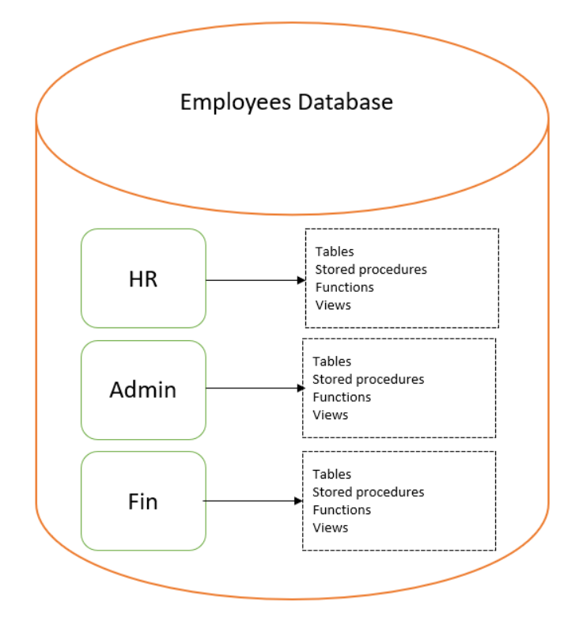

# `CREATE SCHEMA`

- **Schema** - A collection of database objects for organization-purposes
  - Tables
  - Views
  - Triggers
  - Stored Procedures
  - Indexes
- A Schema is associated with a username (*Schema Owner*)
  - Owner of the logically-related database objects
- One-to-Many Relationship
  - A Schema always belongs to *One Database*
  - A Database may have *one or multiple Schemas*
- Every SQL Server schema must have:
  - A Database user
  - A Schema owner
- **The schema is a database-scoped entity**
  - It is posible to have the same schema in different databases of a SQL Server instance



## Benefits of Schemas

- Flexibility and control for managing database objects in logical groups
- Allows to move objects among different schemas quickly
- Enables to manage object security on the schema level
- Allows users to manage logical groups of objects within a database
- Allows users to transfer ownership among various schemas

## Schema Example

In the `BikeStoresSampleDB`, there are 3 Schemas:

- `Hr`
- `Production`
- `Sales`

An object within a schema is qualified as `Schema_Name.Object_Name`

- It is possible for 2 tables in different schemas to share the same name
- In those cases, use the qualified name to distinguish the tables from each other
- Example: `Hr.Employees` vs `Sales.Employees`

## Listing All Schemas and Schema Owners in Current Database

- In SSMS, Schemas are listed under `Security > Schemas` of the current database
- Alternatively, we can run the following query on `Sys.Schemas`:

```sql
SELECT       S.Name               AS Schema_Name
            ,U.Name               AS Schema_Owner
FROM        Sys.Schemas           AS S 
INNER JOIN  Sys.Sysusers          AS U 
  ON        U.Uid = S.Principal_Id
ORDER BY    S.Name;
```

## Built-In Schemas for SQL Server

- `dbo`
- `sys`
- `guest`
- `INFORMATION_SCHEMA`

### `dbo`

- Default schema for all objects in a database
- Owned by the `dbo` user account
- When creating a new user with `CREATE USER`, the user will have `dbo` as its default schema
- We can check the default schema that is connected to a user

```sql
-- Check default schema connected to a user
SELECT Schema_Name() AS DefaultSchema;
```

### `sys`

- Reserved for system objects
- You cannot `CREATE` or `DROP` objects here

### `INFORMATION_SCHEMA`

- Reserved for system objects
- You cannot `CREATE` or `DROP` objects here

## Using `CREATE SCHEMA`

To create a new schema in the current database

```sql
CREATE SCHEMA   Schema_Name
[AUTHORIZATION  Owner_Name];
```

## Example of `CREATE SCHEMA`

```sql
CREATE SCHEMA Customer_Services;
GO
```

After creating a schema, we can start populating it with objects

```sql
--Create a "Jobs" table in the "Customer_Services" schema
CREATE TABLE      Customer_Services.Jobs 
(
     Job_Id       INT             PRIMARY KEY 
                                  IDENTITY
    ,Customer_Id  INT             NOT NULL
    ,Description  VARCHAR(200)
    ,Created_At   DATETIME2       NOT NULL
);
```